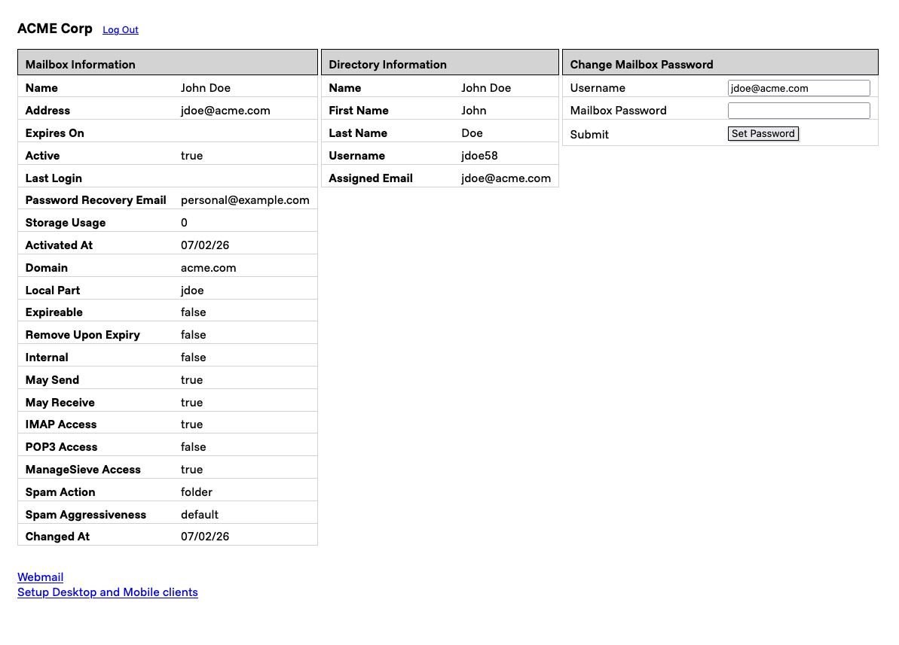

# Migadu SSPR

Allow users to view Mailbox information for Migadu and reset their passwords.

    

## Install

Download the latest [release](https://github.com/HadleySo/migadu-sspr/releases) 
and create a systemd service file.

## Configuration

- Copy [./msspr.example.yaml](msspr.example.yaml) to `data/msspr.yaml`
- Typically `OIDC_SERVER_PORT` should be left blank, unless the redirect URI needs a port
- The displayed Migadu email address is pulled from the `MIGADU_SCOPE` OIDC scope
